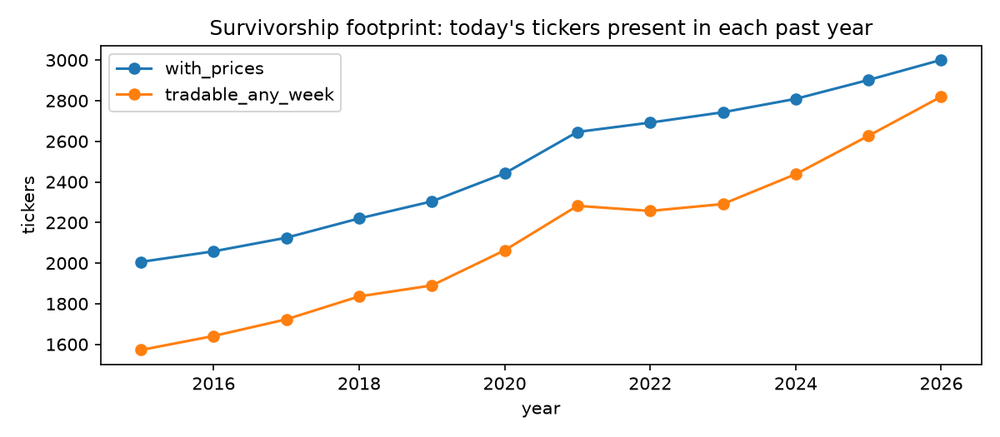
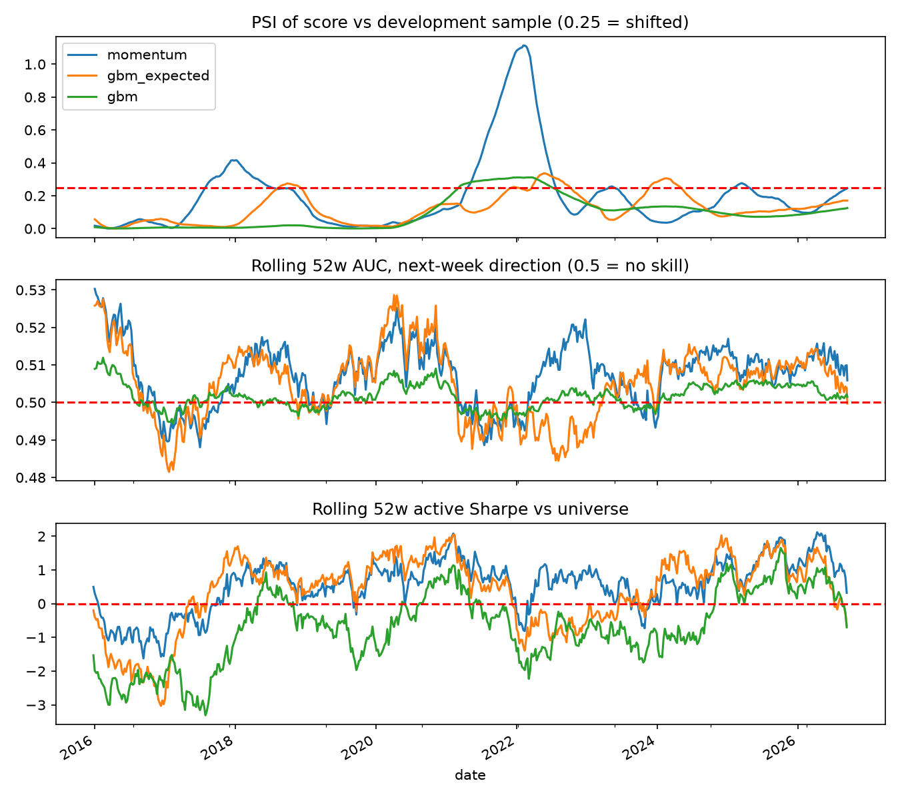
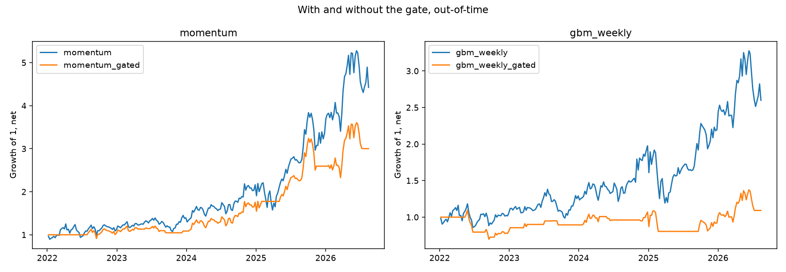
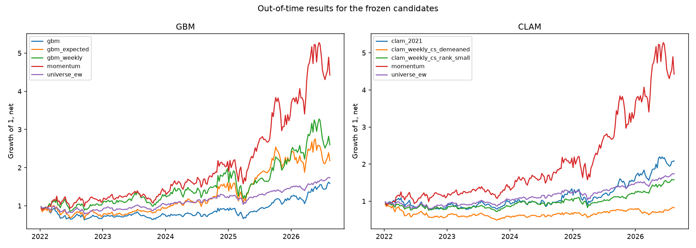

# Model Validation Report — Equity Selection Signals

| | |
|---|---|
| **Models under review** | `gbm` (deployed Monte-Carlo ranking), `gbm_expected` (its closed-form expectation), `momentum` (12-1 benchmark rule), `clam_orig` / `clam_2021` (CNN-LSTM-Attention forecaster) |
| **Model owner** | Long_Term_Trading / Quant_Model_Research (developer: the author, in an earlier role) |
| **Validator** | Signal_Validation — independent re-implementation; no model code modified or tuned |
| **Data** | 3,000 US equities (top by market cap, snapshot 2026-09-15), daily prices 2013-01-02 → 2026-09-14, weekly rebalance 2015-01-02 → 2026-09-12 (612 weeks) |
| **Report date** | 2026-09-15 (round 1) · 2026-09-16 (round 2 revalidation, §12) |
| **Standard followed** | SR 11-7 / OCC 2011-12 structure: purpose, data, methodology, results, findings, limitations, monitoring, conditions of use, decision |

## 1. Executive summary and decision

| model | Q1 overfit tests passed | Q2 current monitoring status | Q3 gate benefit (OOT) | **decision** |
|---|---|---|---|---|
| `momentum` | 2 / 3 (fails Deflated Sharpe) | AUC 0.506, PSI 0.25 (watch) | max DD −29.7% → −22.0%, CAGR 35.5% → 23.7% | **Conditionally approved** as a benchmark only, under §9 conditions |
| `gbm_expected` | 0 / 3 | AUC 0.500, calibration slope −0.03 | gate off 63% of weeks | **Not approved** — no evidence of skill |
| `gbm` (deployed) | 0 / 3 | AUC 0.502 | gate off 92% of weeks | **Not approved** — implementation defect (F1) |
| `clam_orig` | — | — | — | **Not approved** — cannot be validated (F3, F4) |
| `gbm_weekly` (round 2) | 2 / 3 (fails Deflated Sharpe) | AUC 0.507, calibration slope 0.74 | gate destroys return (CAGR 19.3% → −2.6%) | **Not approved** — real but does not beat the momentum benchmark (§12) |
| `clam_weekly_*` (round 2) | 0 / 3 | AUC 0.50 | gate off 61–92% of weeks | **Not approved** — two redevelopment variants, no evidence of skill (§12) |

Across two rounds and eight candidate variants, none is approved for production use; the untuned momentum
rule is retained as the benchmark that any future model must beat. The round-2 redevelopment (§12) confirmed
that the GBM defect was an implementation error (fixed model passes the noise tests) and that the CLAM
approach does not produce a usable weekly signal even after its data-construction defect is repaired. The most valuable outputs are five findings
(§7) that came from reading and reproducing the deployed code rather than from any single statistic.

## 2. Purpose and scope

The model owner uses these signals to rank US equities weekly and hold the top names. This review asks
the three questions a second-line function must answer before approving a model:

1. **Is the backtested performance real, or an artefact of search and noise?** (§5.1)
2. **Is the signal still valid today, and how would we know when it stops being valid?** (§5.2)
3. **What is the rule for switching it off, and does that rule help out-of-time?** (§5.3)

Out of scope: portfolio construction beyond equal-weight top-50, risk limits, and any change to the
models themselves. The validator's job is to accept, reject, or condition — not to redevelop.

## 3. Models under review

| model | as deployed | validator's reproduction |
|---|---|---|
| `gbm` | Fit μ, σ on 504 daily log returns; simulate **one** 65-step GBM path; score = mean(path)/S₀ − 1 | Ported verbatim from `stats_model_process.get_gbm_path_simulation`, fixed seed per date |
| `gbm_expected` | — | E[score] = mean_i exp(μ·tᵢ) − 1: same model without the Monte-Carlo draw. Added by the validator to measure the draw's noise |
| `momentum` | — | P[t−21] / P[t−252] − 1. Textbook 12-1 momentum; no parameter was chosen by looking at the data |
| `clam_orig` | Keras CNN+LSTM+Attention, 252-day input of 5 log-diff features, 65-day output; score = exp(Σ predicted dlog High) − 1 | Weights and scaler loaded as shipped; inference code ported from `clam_inference.py` |
| `clam_2021` | — | Same training script, training window cut at 2021-12-31, to obtain an honest out-of-time period |

All models are evaluated with one backtest engine: weekly rebalance at Friday close, long-only,
top-50 equal weight, 10 bps one-way cost on traded weight, liquidity filter applied before ranking.
Performance is judged on **active return versus the equal-weighted tradable universe**, so that
survivorship and universe effects shared by all candidates cancel.

## 4. Data

| item | value | source |
|---|---|---|
| Universe | 3,000 largest US common equities, one share class per company | Yahoo screener, snapshot 2026-09-15 |
| Prices | 8,104,194 daily OHLCV rows, 3,001 tickers (incl. SPY) | Yahoo Finance |
| Rebalance panel | 1,492,706 (week, ticker) rows, 612 weeks | `sql/queries/build_panel.sql` |
| Tradable filter | close ≥ $5 and 20-day average dollar volume ≥ $5M; 74% of ticker-weeks pass | `config.py` |
| Storage | DuckDB; every derived table is reproducible from `sql/` and `sv/` | `sql/schema.sql` |

**Data quality.** Three tickers (CBIO, NFE, DEC) carry zero or negative adjusted closes on 3,909 rows —
a Yahoo dividend-adjustment artefact. They are kept in `prices` as received and excluded at the panel
and feature layer. One rebalance week (2026-09-14) is a single-day partial week and carries no forward
return.

**Survivorship.** Only 2,006 of today's 3,000 tickers have prices in 2015 (1,572 tradable); the count
rises monotonically to 3,001 in 2026 (fig. 1). Companies delisted before the snapshot are absent. This
inflates absolute returns for every candidate in the same direction; it is the reason all decisions
are made on active return against the same universe, and it is listed as a limitation (§8).

## 5. Methodology

### 5.1 Q1 — overfitting tests (`sv/validation/overfit.py`)

| test | guards against | statistic | pass rule |
|---|---|---|---|
| Stationary block bootstrap (Politis-Romano, mean block 13 weeks, 5,000 draws) | trusting a point estimate of Sharpe | 95% CI of annualised active Sharpe | CI excludes 0 |
| Deflated Sharpe Ratio (Bailey & López de Prado 2014), N = 3 trials | choosing the best of several tries; non-normal returns | P(true SR > expected max SR of 3 noise strategies) | ≥ 0.95 |
| Cross-sectional permutation null (500 shuffles of scores within each week) | the signal–return link being coincidental | share of permuted Sharpes ≥ observed, on gross returns | p < 0.05 |

The permutation null is evaluated on **gross** returns. A shuffled signal turns the book over ~100% a
week; net of costs the null would sit at Sharpe ≈ −1.9 and any persistent signal would pass on cost
savings alone. This was corrected during the review.

### 5.2 Q2 — monitoring (`sv/validation/monitoring.py`, `sql/queries/psi_score.sql`, `auc_by_year.sql`)

For each model and rebalance date, on the trailing 52 weeks ending the week before the date:
`psi_score` (score distribution vs the first 104 weeks, 10 development-sample deciles), `psi_input`
(trailing-252d realised vol, the regime variable), `auc_1w` / `ks_1w` (discrimination of next-week
direction vs the cross-sectional median), `auc_13w` / `ks_13w` / `calib_slope` at the models' 65-day
horizon (lagged 13 weeks so no target is used before it is known), `rolling_sharpe` and
`active_drawdown` at portfolio level. PSI and AUC are recomputed per year in pure SQL as a cross-check.

### 5.3 Q3 — kill switch (`sv/validation/gate.py`)

A rule-based gate, thresholds fixed before the out-of-time window was examined:

| rule | threshold | rationale |
|---|---|---|
| `psi_score` | > 0.25 | industry convention for "population has shifted" |
| `rolling_sharpe` | < 0 | trailing year of negative active return |
| `auc_1w` | < 0.50 | no discriminatory power over the trailing year |
| `active_drawdown` | < −15% | relative drawdown beyond tolerance |

Any breach switches the model to cash for the coming week; each flip pays the full one-way cost.
Portfolio-level metrics are lagged one week so the gate sees only information available on the
decision date. Champion (ungated) and challenger (gated) are compared from 2022-01-03 (246 weeks).

## 6. Results

### 6.1 Full-sample backtest, 2015-01 → 2026-09

| strategy | CAGR | vol | Sharpe | max DD | avg weekly turnover |
|---|---|---|---|---|---|
| `momentum` | 27.0% | 33.8% | 0.88 | −39.9% | 15% |
| `gbm_expected` | 18.8% | 32.4% | 0.70 | −55.2% | 10% |
| `gbm` (deployed) | 3.9% | 27.9% | 0.28 | −46.2% | **90%** |
| universe equal-weight | 12.9% | 20.4% | 0.70 | −40.2% | — |
| SPY | 13.6% | 16.6% | — | — | — |

### 6.2 Q1 — overfitting tests (active return vs universe)

| model | bootstrap SR [95% CI] | verdict | DSR | verdict | permutation p | verdict |
|---|---|---|---|---|---|---|
| `momentum` | 0.65 [0.18, 1.10] | PASS | 0.68 | FAIL | 0.006 | PASS |
| `gbm_expected` | 0.37 [−0.17, 0.89] | FAIL | 0.31 | FAIL | 0.086 | FAIL |
| `gbm` | −0.50 [−1.08, 0.05] | FAIL | 0.00 | FAIL | 0.278 | FAIL |

With only three candidates, the expected maximum Sharpe of pure-noise strategies is already 0.51
annualised; momentum's 0.65 does not clear it with 95% confidence. This is the trading analogue of
peeking in sequential testing: every additional candidate raises the bar.

### 6.3 Q2 — monitoring, latest reading (week of 2026-09-12)

| metric | `momentum` | `gbm_expected` | `gbm` |
|---|---|---|---|
| `psi_score` | 0.246 (watch) | 0.171 (watch) | 0.125 (watch) |
| `psi_input` (realised vol) | 0.611 (shifted) | 0.611 | 0.611 |
| `auc_1w` | 0.506 | 0.500 | 0.502 |
| `auc_13w` | 0.515 | 0.510 | 0.502 |
| `calib_slope` (13w) | — | −0.03 | 0.01 |

No model shows discriminatory power above 0.53 AUC in any calendar year 2015-2026 (SQL cross-check,
`notebooks/02_monitoring.ipynb`). The predicted-return models are uncalibrated: a slope of −0.03 means
a higher predicted 65-day return does not translate into a higher realised one. The volatility regime
has shifted well beyond the development sample (PSI 0.61), which applies to all candidates equally.

### 6.4 Q3 — champion vs challenger, out-of-time 2022-01 → 2026-09

| model | CAGR champion → challenger | max DD champion → challenger | Sharpe champion → challenger | weeks gated off |
|---|---|---|---|---|
| `momentum` | 35.5% → 23.7% | −29.7% → −22.0% | 1.02 → 0.88 | 48% |
| `gbm_expected` | 17.5% → 4.4% | −37.5% → −25.4% | 0.63 → 0.33 | 63% |
| `gbm` | 5.9% → 0.0% | −34.7% → 0.0% | 0.34 → n/a | 92% |
| universe equal-weight | 11.6% | −21.6% | 0.67 | — |

The gate does what it is specified to do — it cuts maximum drawdown by 26% (momentum) and 32%
(`gbm_expected`) — but it costs more return than it saves risk: Sharpe falls in both cases. The
dominant trigger is `active_drawdown`, which fires late. As specified, the kill switch is a drawdown
limiter, not a skill detector; a validator would not approve it as the sole control.

## 7. Findings

| # | model | severity | finding | evidence |
|---|---|---|---|---|
| **F1** | `gbm` | **High** | Scoring by a single Monte-Carlo path adds noise of order σ√T that destroys the ranking: weekly turnover 90% vs 10%, CAGR 3.9% vs 18.8% for the identical model's expectation. The defect is in the implementation, not the model. | median weekly Spearman(single path, expectation) = 0.24 |
| **F2** | `gbm` / `gbm_expected` | Medium | E[score] depends on μ only and exp is monotone, so the "GBM simulation" ranks stocks by 2-year mean log return. The Monte-Carlo machinery adds no information. | Spearman(expected score, trailing mean log return) = 1.00 |
| **F3** | `clam_orig` | **Critical** | Training sequences are cut from 94 tickers concatenated and **sorted by date**: a 252-row window covers ~2.7 calendar days of 94 different stocks, while inference feeds 252 days of one stock. The network was never trained on the input it receives in production. | code review of `clam_model.py` vs `clam_inference.py` |
| **F4** | `clam_orig` | Blocking | Weights dated 2025-08-22: every backtest week before that is in-sample. 56 out-of-time weeks remain, i.e. ~4 independent 65-day horizons — too few for any statistical statement. | `panel` date count after 2025-08-22 |
| **F5** | `momentum` | **High** | Entering one session after the rebalance close removes roughly half the out-of-time CAGR (35.5% → 19.2%). The excess return is concentrated in the first session after each rebalance (top-50 first-session return 11–49% annualised in most years vs 4–8% for the universe). The backtest is only valid under close-of-rebalance execution. | `ret_fwd_1w_lag1` sensitivity, `notebooks/04_findings.ipynb` |
| F6 | all | Low | Yahoo returns negative adjusted closes for 3 tickers; without filtering, momentum scores become infinite and monitoring crashes. | `notebooks/00_data_quality.ipynb` |
| F7 | validator | Process | The original permutation test compared *net* returns and was biased toward passing any low-turnover signal. Corrected (§5.1). | §5.1 |

## 8. Limitations

1. **Survivorship bias** — unavoidable with free data; quantified in §4 and fig. 1. Absolute returns of every candidate are overstated; relative conclusions are more robust than absolute ones.
2. **Single universe snapshot** — market-cap ranks are as of 2026-09-15; the 2015 universe would have contained different names.
3. **Execution assumptions** — trades at the rebalance close at 10 bps one-way; no market impact, no borrow, no capacity constraints. F5 shows results are sensitive to this.
4. **Multiple-testing count** — the DSR uses N = 3 declared candidates. Any undocumented variants tried during development would raise the bar further.
5. **Deep-learning candidate** — `clam_orig` could not be validated on statistical grounds (F4) and `clam_2021` was not yet scored on the validation machine at the report date. The CLAM decision rests on code review (F3), which is sufficient for non-approval.
6. **Costs** are a flat assumption; small-cap names in the tradable set will trade wider than 10 bps.

## 9. Conditions of use and prohibited uses

Applies to `momentum`, the only conditionally approved model:

* Approved **as a benchmark** for evaluating future models, not as a standalone production signal, until the Deflated Sharpe test is passed on a longer sample or with fewer competing candidates.
* Use only within the tradable universe (close ≥ $5, ADV ≥ $5M). Scores outside it are undefined for approval purposes.
* Execution must occur at or within the rebalance session close. Any process that enters the following day is **out of scope** (F5).
* Do not rely on the kill switch as the sole risk control; it limits drawdown after the fact and reduced Sharpe out-of-time (§6.4).
* Not approved for horizons other than one week, for leverage, or for short positions.

Prohibited outright: `gbm` in its deployed single-path form (F1); `clam_orig` for any decision (F3, F4).

## 10. Ongoing monitoring plan

| metric | frequency | amber | red | action on red |
|---|---|---|---|---|
| `psi_score` vs development sample | weekly | 0.10 | 0.25 | gate off; investigate feature drift |
| `auc_1w` (trailing 52w) | weekly | 0.51 | 0.50 | gate off; escalate after 4 consecutive weeks |
| `rolling_sharpe` (trailing 52w, active) | weekly | 0.25 | 0.00 | gate off |
| `active_drawdown` | weekly | −10% | −15% | gate off; review sizing |
| `psi_input` (volatility regime) | weekly | 0.25 | 0.50 | flag: all candidates are outside their development regime |
| full re-validation (Q1 tests) | annually, or after any code change | — | — | re-issue this report |

All metrics are written to `monitoring` and `gate_decisions` in the DuckDB file by the same code
that produced this report, so the monitoring pack is a query, not a re-implementation.

## 11. Recommendations to the model owner

1. **`gbm`**: replace the single Monte-Carlo path with the closed-form expectation (or many paths); then recognise via F2 that the model is a trailing-mean-return rank and decide whether that is the intended signal.
2. **`clam`**: rebuild training sequences per ticker so training and inference share an input structure; retrain with a fixed cut-off date and a held-out period of at least three years before resubmitting.
3. **`momentum`**: document the execution assumption; investigate the first-session concentration (F5) before any live use.
4. **Kill switch**: add a leading indicator (e.g. AUC deterioration with a shorter window) alongside the drawdown rule, and re-test champion vs challenger.

## 12. Round 2 — revalidation after redevelopment (2026-09-16)

Following §11, the model owner redeveloped both rejected models for a **weekly** horizon. The validator's
role in round 2 was unchanged: same backtest engine, same three questions, same out-of-time window, and
every variant the developer tried is counted as a trial in the Deflated Sharpe Ratio (`N_TRIALS_DSR = 10`:
3 round-1 candidates + 6 GBM variants + 1 CLAM variant retained after 3 attempts).

### 12.1 What the developer changed

| model | change | developer-side selection (development sample < 2022 only) |
|---|---|---|
| `gbm_weekly` | horizon 65 → 5 days; the single Monte-Carlo path replaced by the closed-form expectation (F1); lookback re-chosen | 6 variants (lookback 63 / 126 / 252 × expected / prob-up); best development Sharpe → `gbm_w_126_expected` |
| `clam_weekly_cs_demeaned` | sequences built per ticker (F3); training cut at 2021-12-31 (F4); horizon 5 days; scalar target = next-5-day log return minus that week's cross-sectional mean; top-500 training universe | validation rank IC 0.014 |
| `clam_weekly_cs_rank_small` | as above with a within-week percentile-rank target and a smaller network | validation rank IC 0.016 |
| *(discarded)* | raw-return target (IC −0.008); weekly-bar input (collapsed to a constant) | — |

### 12.2 Results

Q1, full sample 2015-01 → 2026-09, active return vs universe (DSR hurdle at N = 10 is SR₀ = 0.86):

| model | active Sharpe [95% CI] | bootstrap | permutation p | DSR | passed |
|---|---|---|---|---|---|
| `momentum` (benchmark) | 0.65 [0.18, 1.10] | PASS | 0.004 PASS | 0.24 FAIL | 2 / 3 |
| **`gbm_weekly`** | 0.49 [CI > 0] | **PASS** | **0.026 PASS** | 0.11 FAIL | **2 / 3** |
| `gbm_expected` (round 1) | 0.37 | FAIL | 0.080 FAIL | 0.05 FAIL | 0 / 3 |
| `gbm` (deployed) | −0.50 | FAIL | 0.226 FAIL | 0.00 FAIL | 0 / 3 |
| `clam_weekly_cs_rank_small` | 0.04 | FAIL | 0.106 FAIL | 0.00 FAIL | 0 / 3 |
| `clam_weekly_cs_demeaned` | −0.68 | FAIL | 0.704 FAIL | 0.00 FAIL | 0 / 3 |

Out-of-time 2022-01 → 2026-09:

| strategy | CAGR | vol | Sharpe | max DD | one-day execution lag |
|---|---|---|---|---|---|
| `momentum` | 35.5% | 36.3% | 1.02 | −29.7% | 19.2% |
| `gbm_weekly` | 19.3% | 36.2% | 0.67 | −43.4% | 8.3% |
| `gbm_expected` | 17.5% | 35.6% | 0.63 | −37.5% | 11.4% |
| `clam_weekly_cs_rank_small` | 10.7% | 22.5% | 0.57 | −24.1% | 9.1% |
| `clam_weekly_cs_demeaned` | −0.1% | 26.8% | 0.13 | −39.0% | — |
| universe equal-weight | 11.6% | 19.2% | 0.67 | −21.6% | — |

Monitoring: no candidate exceeds AUC 0.53 in any calendar year (SQL cross-check); `gbm_weekly` is the only
model with a meaningful calibration slope at the 13-week horizon (0.74). The gate switches `gbm_weekly`
off 59% of weeks and turns its out-of-time CAGR from 19.3% to −2.6%, confirming the round-1 conclusion
that the rule set as specified is not a usable control.

### 12.3 Findings added in round 2

| # | model | severity | finding |
|---|---|---|---|
| F8 | `gbm_weekly` | Medium | The fixed model is statistically distinguishable from noise (bootstrap and permutation pass) but its out-of-time Sharpe (0.67) equals the equal-weighted universe and trails the untuned benchmark (1.02) with a deeper drawdown. Reason for rejection moves from *implementation defect* to *no value over benchmark*. |
| F9 | `clam_weekly_*` | High | After repairing F3/F4 and trying four target/input variants on a 478-ticker, 142k-window training set, the best validation rank IC is 0.016 and out-of-time performance is indistinguishable from the universe. The limitation is the approach — OHLCV sequences alone carry no exploitable weekly cross-sectional signal at this scale — not the implementation. |
| F10 | process | Low | Multiple-testing accounting: raising the trial count from 3 to 10 lifts the DSR hurdle from SR₀ = 0.51 to 0.86 and fails every candidate including the benchmark. Development iterations must be logged so the validator can count them. |

### 12.4 Decision

| model | round 1 | round 2 |
|---|---|---|
| `momentum` | conditionally approved as benchmark | unchanged |
| `gbm` → `gbm_weekly` | not approved (F1) | **not approved** — passes noise tests, fails to beat benchmark (F8); may be resubmitted with a documented economic rationale and a smaller trial count |
| `clam_orig` → `clam_weekly_*` | not approved (F3, F4) | **not approved** — recommend discontinuing the sequence-model approach for weekly selection (F9) |

Recommendation to the owner: stop iterating on CLAM; if GBM-weekly is pursued, its only demonstrated
content is trailing mean return (F2), so it should be compared against — or merged into — the momentum
benchmark rather than maintained as a separate model.

## Appendix A — assumptions (`config.py`)

| assumption | value |
|---|---|
| universe size / snapshot | 3,000 / 2026-09-15 |
| price history | 2013-01-01 → 2026-09-14 |
| backtest start / rebalance | 2015-01-02 / weekly, last trading day (Friday) |
| holdings / weighting | top 50 / equal |
| cost | 10 bps one-way on traded weight |
| liquidity filter | close ≥ $5, 20-day ADV ≥ $5M |
| momentum | 252-day lookback, 21-day skip |
| GBM | 504-day lookback, 65-day horizon |
| CLAM | 252-day input, 65-day horizon; original weights through 2025-08-22; retrain cut 2021-12-31 |
| bootstrap | stationary, mean block 13 weeks, 5,000 draws |
| DSR trials | 3 (round 1) / 10 (round 2) |
| monitoring window / development sample | 52 weeks / first 104 weeks |
| out-of-time window | from 2022-01-03 |

## Appendix B — reproduction

`README.md` lists the eight commands that rebuild every table and number in this report from a
fresh checkout. Workpapers: `notebooks/00_data_quality` … `05_round2`; developer side: `Quant_Model_Research/clam_weekly.ipynb`, `Long_Term_Trading/gbm_weekly.py`.
