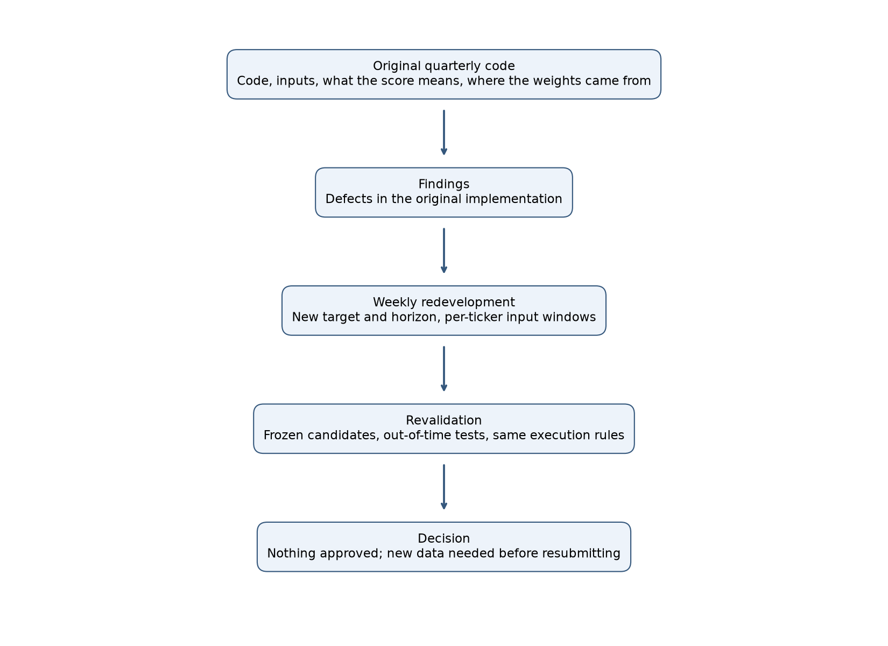
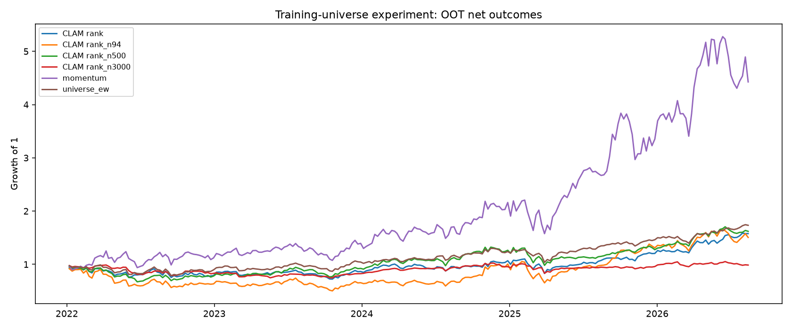

# Model validation review: GBM and CLAM

Revised 2026-09-22. I built these models and reviewed them myself, using the structure a bank's second-line model validation team would follow. That makes this a self-review. It is not independent and has no regulatory standing.

## 1. Decision

**No candidate is approved for production.** Momentum stays in the review as a yardstick for the others.

The review ran in two stages. First I went through the original quarterly models and how they would be used in a weekly strategy. Then I rebuilt both models for a weekly horizon and reviewed the new versions on their own. Fixing a coding defect and changing the forecast horizon are different kinds of change, so the weekly results say nothing about whether a correctly built quarterly model would work.

The figures here replace the ones in earlier drafts. Those drafts ran the tests over the whole sample, used a shortened holding period in the lag check and scored CLAM with a faulty direction metric, so none of their numbers should be used. Testing now covers 2022-01-03 to 2026-08-28: 241 complete weekly holding periods, all after the training and selection cutoff. I had already looked at this period in earlier rounds, which makes it out-of-time but not a clean holdout.

## 2. How the review ran

| stage | what it covered | outcome |
| --- | --- | --- |
| Original quarterly code | The code, how inputs are built, what the score means, where the weights came from | GBM ranks stocks on one random path; CLAM mixes tickers inside training windows; the CLAM direction metric was wrong; the original weights' training cutoff can't be verified |
| 2021 twin | The original CLAM method retrained on data up to 2021-12-31 | `clam_2021`, which keeps the original defects so it stays true to the original method |
| Weekly redevelopment | A weekly target and horizon, and per-ticker input windows | `gbm_weekly` and `clam_weekly_*`, reviewed as new models |
| Revalidation | The same execution rules, out-of-time tests, monitoring and gate for every candidate | Sections 5 to 7; nothing approved |
| Next review | A frozen specification and new evidence | Data collected after the freeze, a point-in-time universe, a full experiment log, real execution data |

The strategy under test holds the 50 highest-scored stocks each week, long only and equally weighted. It isn't a quarterly buy-and-hold backtest; section 7 checks the quarterly forecasts against quarterly targets separately. Risk limits, capacity and live trading were out of scope.

## 3. Candidates and how closely they match the originals

| candidate | what it is | notes |
| --- | --- | --- |
| `gbm` | The original score: the mean of one simulated 63-step price path (T = 0.25) | Two calendar years of history (at least 454 returns), adjusted closes up to and including the signal day, one fixed seed per run. Same formula as the original, though it can't replay the original's live downloads or random draws |
| `gbm_expected` | The expected value of that score, in closed form | Ranks stocks exactly as their mean log return does. Used as a diagnostic |
| `clam_orig` | The original quarterly weights | The .h5 and scaler files aren't in this checkout and their training cutoff is unknown. A file timestamp can't show which dates were used in training |
| `clam_2021` | The original CLAM method, retrained to 2021-12-31 | Weights unchanged since training. It keeps the original window and metric defects on purpose |
| `gbm_weekly` | `gbm_w_126_expected`, picked in the earlier development round | All six lookback and score variants are logged. I didn't re-pick it after changing the execution rules |
| `clam_weekly_*` | Weekly CLAM with per-ticker windows and a single-number target | The universe-size runs were trained separately. Demeaned and rank scores aren't return forecasts |
| `momentum` | The standard 12-1 momentum rule | Same data and execution rules as the others |

The original GBM uses 63 steps; earlier drafts said 65 by mistake. The two quarterly models also score different things: GBM averages a simulated price path, and CLAM adds up predicted daily log changes in the High price. Reproducing the GBM formula checks the code, but the model's economic assumptions still need their own justification. How accurate a forecast is and how well it picks stocks are separate questions.

## 4. Data and backtest rules

Prices run from 2013-01-02 to 2026-08-28. Anything later in the raw files is ignored. The stock list is a snapshot of the 3,000 largest US companies on 2026-09-15, so it only holds firms that survived to that date and were picked using later market caps. Comparing against an equal-weighted portfolio of the same stocks doesn't remove that bias, and I can't tell how much it helps or hurts each strategy. Downloading the data again would give a different dataset.

Each signal uses the week's last close. The trade fills at the next session's close and is held until the next session's close after the following signal. All dates come from SPY's trading calendar, and a missing quote is never filled with a later price. Same-close results (`*_same_close`) are kept as an optimistic comparison only.

No price after 2026-08-28 is used anywhere, including signals, returns, calibration and the CLAM audit. Holding periods and targets that end after that date are dropped, and a missing return for a held stock stops the run with an error. Every candidate has the same cutoff.

A stock is tradable on a signal date if it closes at $5 or more and has traded at least $5M a day on average over the last 20 sessions. The top 50 tradable scores get equal weight. Trading costs 10 bps of the absolute weight traded, including drift in existing positions, and the equal-weight benchmark pays the same costs. Filling at the close with no market impact is a simplification. Cash earns nothing, and active Sharpe uses the strategy's return minus the equal-weight benchmark.

## 5. Q1: is the out-of-time record better than chance?

The stationary bootstrap uses 5,000 draws with a mean block of 13 weeks, and a model passes if the 95% interval sits above zero. The permutation test reshuffles which stocks are held within each week's scored set 500 times, compares gross active returns, and reports p = (1 + exceedances) / 501. It is conditional on this snapshot and doesn't keep sector or exposure structure. Passing either test on its own wouldn't show that the model can make money in practice.

| model | active SR [95% CI] | bootstrap | permutation p | permutation | DSR (provisional) |
| --- | --- | --- | --- | --- | --- |
| momentum | 0.90 [0.26, 1.53] | PASS | 0.020 | PASS | 0.390 |
| gbm | 0.06 [-0.80, 0.86] | FAIL | 0.084 | FAIL | 0.019 |
| gbm_expected | 0.39 [-0.31, 1.12] | FAIL | 0.164 | FAIL | 0.086 |
| gbm_weekly | 0.50 [-0.12, 1.15] | FAIL | 0.106 | FAIL | 0.129 |
| clam_2021 | 0.36 [-0.37, 1.05] | FAIL | 0.136 | FAIL | 0.075 |
| clam_weekly_cs_demeaned | -0.89 [-1.56, -0.19] | FAIL | 0.838 | FAIL | 0.000 |
| clam_weekly_cs_rank_small | -0.09 [-0.82, 0.65] | FAIL | 0.323 | FAIL | 0.008 |
| clam_weekly_cs_rank_small_n94_seed20260922 | 0.09 [-0.83, 1.01] | FAIL | 0.307 | FAIL | 0.022 |
| clam_weekly_cs_rank_small_n500_seed20260922 | -0.04 [-0.80, 0.75] | FAIL | 0.267 | FAIL | 0.011 |
| clam_weekly_cs_rank_small_n3000_seed20260922 | -0.99 [-1.65, -0.35] | FAIL | 0.902 | FAIL | 0.000 |

The Deflated Sharpe Ratio is reported but doesn't decide anything yet. `experiments.json` lists at least 17 trials, including the three training-universe runs, and counts the `gbm_weekly` alias once. 15 of them have returns; the raw-target and weekly-bar CLAM runs left no usable scores. The DSR takes its variance from those 15 Sharpe ratios and uses N = 17. Searches I didn't log and correlation between trials would both raise the hurdle, so the trial count can only go up from here.

## 6. Out-of-time portfolio results and the gate

| model | weeks | CAGR | vol | Sharpe | max DD | active SR |
| --- | --- | --- | --- | --- | --- | --- |
| momentum | 241 | 37.8% | 41.1% | 0.987 | -28.6% | 0.898 |
| gbm | 241 | 10.5% | 31.5% | 0.474 | -37.1% | 0.065 |
| gbm_expected | 241 | 18.4% | 41.3% | 0.614 | -34.5% | 0.391 |
| gbm_weekly | 241 | 22.9% | 41.2% | 0.706 | -39.6% | 0.501 |
| clam_2021 | 241 | 17.2% | 34.2% | 0.635 | -32.4% | 0.360 |
| clam_weekly_cs_demeaned | 241 | -4.1% | 29.7% | 0.010 | -50.6% | -0.895 |
| clam_weekly_cs_rank_small | 241 | 10.3% | 24.7% | 0.522 | -27.8% | -0.089 |
| clam_weekly_cs_rank_small_n94_seed20260922 | 241 | 9.2% | 37.4% | 0.423 | -49.8% | 0.087 |
| clam_weekly_cs_rank_small_n500_seed20260922 | 241 | 11.0% | 24.2% | 0.552 | -32.8% | -0.040 |
| clam_weekly_cs_rank_small_n3000_seed20260922 | 241 | -0.3% | 15.3% | 0.058 | -25.5% | -0.988 |
| universe_ew | 241 | 12.6% | 19.9% | 0.696 | -21.3% | n/a |
| benchmark_spy | 241 | 12.7% | 16.7% | 0.802 | -21.8% | -0.054 |

These figures describe the tested versions on this dataset. Failing the tests doesn't prove a model has no skill, and four CLAM variants can't settle whether price-based sequence models work in general. For approval, a model would have to add value over the benchmark on new data, and a high CAGR alone doesn't show that.

| model | CAGR ungated / gated | max DD ungated / gated | Sharpe ungated / gated | off |
| --- | --- | --- | --- | --- |
| momentum | 37.8% / 26.8% | -28.6% / -28.2% | 0.99 / 0.91 | 33.6% |
| gbm | 10.5% / 0.0% | -37.1% / 0.0% | 0.47 / n/a | 100.0% |
| gbm_expected | 18.4% / 3.5% | -34.5% / -21.5% | 0.61 / 0.30 | 85.9% |
| gbm_weekly | 22.9% / 1.9% | -39.6% / -36.3% | 0.71 / 0.21 | 61.0% |
| clam_2021 | 17.2% / 0.0% | -32.4% / 0.0% | 0.63 / n/a | 100.0% |
| clam_weekly_cs_demeaned | -4.1% / 0.0% | -50.6% / 0.0% | 0.01 / n/a | 100.0% |
| clam_weekly_cs_rank_small | 10.3% / 0.0% | -27.8% / 0.0% | 0.52 / n/a | 100.0% |
| clam_weekly_cs_rank_small_n94_seed20260922 | 9.2% / 0.0% | -49.8% / 0.0% | 0.42 / n/a | 100.0% |
| clam_weekly_cs_rank_small_n500_seed20260922 | 11.0% / 0.0% | -32.8% / 0.0% | 0.55 / n/a | 100.0% |
| clam_weekly_cs_rank_small_n3000_seed20260922 | -0.3% / 0.0% | -25.5% / 0.0% | 0.06 / n/a | 100.0% |

The gate moves a strategy to cash for the week if score PSI is above 0.25, trailing active Sharpe is below zero, AUC is below 0.50, or relative drawdown is worse than -15%. It also switches off if any of those metrics is missing. Portfolio metrics lag two signal weeks, since with next-day execution the previous holding period hasn't finished by the current signal. Costs come from the positions the gated strategy actually holds, and relative drawdown compares strategy wealth with benchmark wealth.

The thresholds are common conventions and weren't fitted to this data, and I can't show they were set before I looked at the out-of-time period. Changing them would need a fresh evaluation. The gate is an experiment and shouldn't be the only risk control.

## 7. Monitoring, targets and the CLAM metric audit

| model | psi_score | psi_input | auc_1w | rolling_sharpe | active_drawdown |
| --- | --- | --- | --- | --- | --- |
| momentum | 0.236 | 0.614 | 0.508 | 0.903 | -0.217 |
| gbm | 0.129 | 0.614 | 0.502 | 1.361 | -0.292 |
| gbm_expected | 0.183 | 0.614 | 0.505 | -0.004 | -0.316 |
| gbm_weekly | 0.179 | 0.614 | 0.507 | 0.826 | -0.257 |
| clam_2021 | 0.080 | 0.614 | 0.507 | 1.247 | -0.299 |
| clam_weekly_cs_demeaned | 0.148 | 0.614 | 0.498 | -0.911 | -0.702 |
| clam_weekly_cs_rank_small | 0.125 | 0.614 | 0.502 | 1.419 | -0.329 |
| clam_weekly_cs_rank_small_n94_seed20260922 | 0.407 | 0.614 | 0.505 | 0.964 | -0.268 |
| clam_weekly_cs_rank_small_n500_seed20260922 | 0.133 | 0.614 | 0.508 | 0.897 | -0.270 |
| clam_weekly_cs_rank_small_n3000_seed20260922 | 0.092 | 0.614 | 0.509 | -1.739 | -0.643 |

PSI buckets are open at both tails so drifted scores still get counted. The reference period is the first 104 signal weeks, and PSI starts after it. Weekly AUC uses only finished targets, and the 65-session diagnostics use each target's actual maturity date. AUC here is pooled across all stocks and dates, which isn't the same as how well the top 50 do.

The calibration table pairs each raw-return score with its own target and horizon, using out-of-time observations that matured by 2026-08-28. The coefficients are descriptive and come without significance tests. Regressing a weekly score on a 13-week return only shows association.

| model | horizon_sessions | n | slope | intercept | mae |
| --- | --- | --- | --- | --- | --- |
| gbm | 63 | 470585 | -0.004 | 0.018 | 0.137 |
| gbm_expected | 63 | 470585 | -0.074 | 0.019 | 0.093 |
| gbm_weekly | 5 | 518297 | -0.041 | 0.003 | 0.044 |
| clam_2021 | 65 | 477325 | 0.002 | 0.032 | 0.368 |

The targets are: for GBM, the average adjusted price from t to t+63 relative to t; for weekly GBM, adjusted Close[t+5] / Close[t] - 1; for the original CLAM, raw High[t+65] / High[t] - 1. The rank and demeaned weekly CLAM scores can't be mapped back to returns without the exact training cross-section, so they aren't calibrated. Overlapping targets and correlation between stocks make all of these hard to read.

The 2021 twin was scored on 1478 single-stock out-of-time windows (96070 daily close targets). On the same predictions, the old scaled-sign accuracy was 59.08% and the corrected return-direction accuracy was 49.79%.

That fixed alphabetical sample tests the metric itself. It doesn't reproduce the 76% and 64% training and validation figures from the original run. MinMax scaling to (-1, 1) doesn't send a zero return to zero, so the corrected metric compares scaled values against the scaled value of zero. New training of the original model uses the corrected metric for early stopping. The existing weights weren't retrained, and the 2021 twin script asks for the old metric on purpose so it matches the original. The cross-ticker windows are a separate, confirmed defect. An earlier draft said the network had learned same-day market direction; I've dropped that claim.

### 7.1 Training-universe size: 94, 500 and 3000 stocks

The original CLAM was trained on 94 hand-picked stocks, mostly because training took a long time. To check whether that held it back, I trained the small weekly rank-target model three times and changed only the number of stocks used in training: 94, 500 and 3000, picked by market cap. All three runs use seed 20260922, the same callbacks and the same purged validation split, and none of them was chosen by looking at out-of-time results. Training targets end before 2019-12-31 and selection targets by 2021-12-31. Fewer stocks are usable than requested because newer listings have no training history. A smaller universe is also an easier ranking problem, so validation IC can't be compared directly across the three.

| requested_tickers | usable_tickers | training_windows | epochs | validation_rank_ic | oot_cagr | oot_active_sharpe | bootstrap | permutation_p |
| --- | --- | --- | --- | --- | --- | --- | --- | --- |
| 94 | 89 | 27869 | 8 | 0.067 | 9.2% | 0.087 | FAIL | 0.307 |
| 500 | 476 | 142185 | 7 | 0.024 | 11.0% | -0.040 | FAIL | 0.267 |
| 3000 | 2567 | 659736 | 9 | 0.016 | -0.3% | -0.988 | FAIL | 0.902 |

Mean annual net-return difference against the new 500-stock run, with 95% bootstrap intervals: 94 stocks 2.48% [-14.56%, 21.78%]; 3000 stocks -12.46% [-23.06%, -1.20%]. These are differences in mean return, which isn't the same as a CAGR difference. The 94-stock and 500-stock runs can't be told apart on this sample. The 3000-stock run is worse than the 500-stock run on this sample. So there's no sign that the original 94-stock list was what held CLAM back. This is one seed on a period I had already studied, and changing the universe also changes the peer group each stock is ranked against, so it doesn't settle how training-set size matters in general. The older 500-stock model is shown for reference; the new 500-stock run is the like-for-like comparison.

## 8. Findings

| ID | finding | what was done | status |
| --- | --- | --- | --- |
| F1 | Scoring on one simulated path adds noise to the ranking | Added the closed-form expectation for comparison and revised the tables | Original not approved. The fix on its own doesn't show an edge |
| F2 | The expected GBM score ranks stocks the same way as mean log return | Stated in the model description and compared with momentum | Needs an economic reason to be a separate model |
| F3 | The original CLAM training windows mix tickers | Found in code review; the weekly version uses per-ticker windows | Open in the original. The fixed version is a different model |
| F4 | No way to verify what data the original weights were trained on | Dropped the timestamp-based cutoff; the files aren't here; the twin's cutoff is recorded | Blocks any verdict on the original weights |
| F5 | Same-close fills, and the lag check used a shorter holding period | Next-close to next-close execution, drift-aware costs, calendar tests | Fixed in the backtest; no live execution data yet |
| F6 | Zero, negative and missing prices | Input filters; held-stock returns never filled with zero; one common end date | Problems in the source data remain |
| F7 | My permutation test was biased by trading costs | Now compares gross returns, with a finite-sample p-value | Fixed; the test's conditional null is noted |
| F8 | Earlier tests included development-period data | Q1 now runs on out-of-time data only | Fixed, though that period has been looked at before |
| F9 | Earlier drafts generalised from a few CLAM runs to the whole approach | Conclusions now cover only what was tested | Claim withdrawn |
| F10 | Not every experiment was counted for multiple testing | A log of at least 17 trials, 15 with returns; DSR marked provisional | Open until the search history is complete |
| F11 | The direction metric took signs after scaling | Corrected the threshold, re-scored the same predictions, fixed the training monitor | Metric fixed; old weights and early-stopping choices unchanged |
| F12 | Calibration compared forecasts and targets over different horizons | Matched targets, left rank scores out, renamed the cross-horizon slope | Fixed; nothing approved on calibration |
| F13 | Earlier drafts overstated independence and how exact the reproductions were | Stated the self-review role, listed the differences, recorded file hashes | Wording fixed |

## 9. Decision and what a resubmission needs

None of the GBM or CLAM versions is approved for production. `clam_orig` also lacks the files and training cutoff it would need to be reviewed at all. Momentum is only a comparison. None of this rules out quarterly models in general, or sequence models as a family.

A resubmission would need a fixed use and horizon, a documented history of the training data and model, a complete experiment log, a point-in-time stock universe or a bounded estimate of the survivorship bias, realistic execution, cost and capacity tests, matched-target diagnostics, and new data collected after the specification is frozen. Trials already run keep counting. A quarterly-only study would be its own project, with quarterly targets and quarterly holding rules.

Ongoing monitoring would check PSI, AUC, relative drawdown and active Sharpe every week. A breach or a missing metric pauses the strategy until someone investigates. Any material change to the model, the data or the execution means revalidating. This report doesn't clear any model for production.

## 10. Reproducing the results

`sh scripts/revalidate.sh` rebuilds everything from the saved database and scores: the panel, the GBM reproduction, portfolio returns, the out-of-time tests, monitoring, the gate, this report and its figures. It doesn't re-pick the weekly models. `scripts/audit_clam_metric.py` rebuilds the metric audit and needs TensorFlow. `tests/test_validation_contracts.py` covers timing, missing data, drift, PSI tails, out-of-time filtering and the metric threshold.

The notebooks read the same database, and the CSVs next to this report hold its tables. `review_manifest.json` records file hashes and the evaluation settings, and the PDF is generated from this Markdown. No new prices were downloaded and nothing was deployed. The historical CLAM weights haven't changed; the 94, 500 and 3000-stock runs are new models trained for section 7.1.

The structure follows the conceptual-soundness, monitoring and outcome-analysis parts of the Federal Reserve's [SR 11-7 guidance](https://www.federalreserve.gov/supervisionreg/srletters/sr1107a1.pdf). I used it as a template; the report makes no claim of regulatory compliance.
